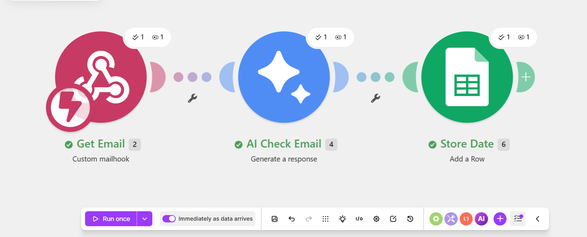

# AI Job Application Email Screening & Google Sheets Automation

## Project Overview

An AI-powered email screening automation that automatically analyze incoming emails and identifies whether they are job applications.

The workflow uses Make.com to connect Gmail, Google Gemini, and Google Sheets.

## Problem

HR teams and businesses can receive a large number of emails every day. Manually reading and categorizing job applications takes time and can lead to inconsistent organization.

## Solution

This automation analyze incoming email content with Google Gemini and automatically stores the email information and AI classification result in Google Sheets.

## Workflow

Gmail / Mailhook
↓
Make.com
↓
Google Gemini
↓
AI Classification
↓
Google Sheets

### How it works

1. A new email is received.
2. Gmail forwards the email to a Make.com Mailhook.
3. Make.com receives the email data.
4. The email content is sent to Google Gemini.
5. Gemini analyzes the content and classifies the email.
6. Make.com sends the result to Google Sheets.
7. Google Sheets stores the email information and AI classification.

## Tools Used

* Gmail
* Make.com
* Google Gemini
* Google Sheets

## AI Classification

The AI is configured to identify whether an incoming email is:

* Job Application
* Not a Job Application

## Data Stored

The automation stores information such as:

* Date
* Sender
* Subject
* Email body
* AI classification result

## Business Use Case

This type of automation can help HR teams and recruitment businesses reduce repetitive email screening and keep incoming applications organized.

The same workflow can also be adapted for customer support, sales inquiries, university admissions, and other business processes that require email classification.

## Project Result

Successfully built and tested an AI-powered email screening workflow that automatically receives email data, analyzes the content with Google Gemini, and stores the results in Google Sheets.

## Skills Demonstrated

* AI Automation
* Workflow Automation
* Make.com
* Google Gemini
* Gmail Automation
* Google Sheets
* Email Classification
* Business Process Automation

## Project Status

**Completed and tested successfully.**

## Workflow Screenshot

## AI Classification Screenshot

